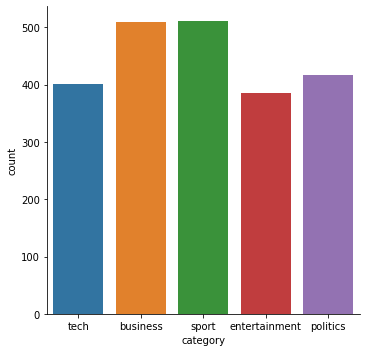

```python
# This Python 3 environment comes with many helpful analytics libraries installed
# It is defined by the kaggle/python docker image: https://github.com/kaggle/docker-python
# For example, here's several helpful packages to load in 

import numpy as np # linear algebra
import pandas as pd # data processing, CSV file I/O (e.g. pd.read_csv)

# Input data files are available in the "../input/" directory.
# For example, running this (by clicking run or pressing Shift+Enter) will list all files under the input directory

import os
for dirname, _, filenames in os.walk('/kaggle/input'):
    print(dirname)

# Any results you write to the current directory are saved as output.
```

# Importing libraries


```python
import seaborn as sns
import re
from nltk.corpus import stopwords
from nltk.stem.porter import PorterStemmer
from nltk.stem import WordNetLemmatizer
from sklearn.feature_extraction.text import TfidfVectorizer
from sklearn.preprocessing import LabelEncoder, OneHotEncoder
from sklearn.naive_bayes import MultinomialNB
```


```python
data = pd.read_csv('bbc-text.csv')
```

# studying data


```python
data.head(10)
```


<div>
<style scoped>
    .dataframe tbody tr th:only-of-type {
        vertical-align: middle;
    }

    .dataframe tbody tr th {
        vertical-align: top;
    }

    .dataframe thead th {
        text-align: right;
    }
</style>
<table border="1" class="dataframe">
  <thead>
    <tr style="text-align: right;">
      <th></th>
      <th>category</th>
      <th>text</th>
    </tr>
  </thead>
  <tbody>
    <tr>
      <th>0</th>
      <td>tech</td>
      <td>tv future in the hands of viewers with home th...</td>
    </tr>
    <tr>
      <th>1</th>
      <td>business</td>
      <td>worldcom boss  left books alone  former worldc...</td>
    </tr>
    <tr>
      <th>2</th>
      <td>sport</td>
      <td>tigers wary of farrell  gamble  leicester say ...</td>
    </tr>
    <tr>
      <th>3</th>
      <td>sport</td>
      <td>yeading face newcastle in fa cup premiership s...</td>
    </tr>
    <tr>
      <th>4</th>
      <td>entertainment</td>
      <td>ocean s twelve raids box office ocean s twelve...</td>
    </tr>
    <tr>
      <th>5</th>
      <td>politics</td>
      <td>howard hits back at mongrel jibe michael howar...</td>
    </tr>
    <tr>
      <th>6</th>
      <td>politics</td>
      <td>blair prepares to name poll date tony blair is...</td>
    </tr>
    <tr>
      <th>7</th>
      <td>sport</td>
      <td>henman hopes ended in dubai third seed tim hen...</td>
    </tr>
    <tr>
      <th>8</th>
      <td>sport</td>
      <td>wilkinson fit to face edinburgh england captai...</td>
    </tr>
    <tr>
      <th>9</th>
      <td>entertainment</td>
      <td>last star wars  not for children  the sixth an...</td>
    </tr>
  </tbody>
</table>
</div>


```python
data['category'].value_counts()
```


    sport            511
    business         510
    politics         417
    tech             401
    entertainment    386
    Name: category, dtype: int64


```python
type(data['category'])
```


    pandas.core.series.Series


```python
sns.catplot(x = 'category', kind='count',data=data)
```


    <seaborn.axisgrid.FacetGrid at 0x2208e60cdc8>





```python
data.describe()
```


<div>
<style scoped>
    .dataframe tbody tr th:only-of-type {
        vertical-align: middle;
    }

    .dataframe tbody tr th {
        vertical-align: top;
    }

    .dataframe thead th {
        text-align: right;
    }
</style>
<table border="1" class="dataframe">
  <thead>
    <tr style="text-align: right;">
      <th></th>
      <th>category</th>
      <th>text</th>
    </tr>
  </thead>
  <tbody>
    <tr>
      <th>count</th>
      <td>2225</td>
      <td>2225</td>
    </tr>
    <tr>
      <th>unique</th>
      <td>5</td>
      <td>2126</td>
    </tr>
    <tr>
      <th>top</th>
      <td>sport</td>
      <td>virus poses as christmas e-mail security firms...</td>
    </tr>
    <tr>
      <th>freq</th>
      <td>511</td>
      <td>2</td>
    </tr>
  </tbody>
</table>
</div>


```python
data.index
```


    RangeIndex(start=0, stop=2225, step=1)


# Preprocessing data


```python
import nltk
nltk.download('stopwords')
```

    [nltk_data] Downloading package stopwords to
    [nltk_data]     C:\Users\daisycharlie\AppData\Roaming\nltk_data...
    [nltk_data]   Unzipping corpora\stopwords.zip.
    


    True


```python
import pickle
```


```python
#loading stop words list
stop_words = set(stopwords.words('english'))
stemmer = PorterStemmer()
lemmatizer = WordNetLemmatizer()
print(stop_words)
```

    {'aren', 'who', 'me', 'below', 'she', 'on', 'can', 'been', 'as', 'an', "shan't", 'now', 'or', 'until', 'mustn', 'no', "mightn't", 'during', 'again', 'then', 'over', 'that', 'itself', 'd', 'which', 'to', 'other', 'up', 'and', 'was', 'when', 'yourself', 'here', 'it', 'her', 'ours', 'them', 'these', "needn't", 'this', 'have', 't', 'o', 'those', 'most', 'you', "it's", 'before', 'my', 'only', 'hadn', 'too', 'own', 'each', "aren't", 'for', "hadn't", 'ain', "hasn't", 'doing', "haven't", 'shouldn', "you'd", 'why', 'such', "isn't", 'so', 'against', 'is', 'ma', 'between', "you're", 'has', 'after', "shouldn't", 'herself', 'isn', 'where', 'll', 'theirs', 'if', "weren't", 'having', 'were', 'about', 'any', 'weren', 'are', 'needn', "should've", 'y', "you'll", 'yourselves', "didn't", "won't", 'himself', "don't", "couldn't", 'we', 'themselves', 'its', 's', 'his', 'under', 'should', 'does', "wasn't", 'more', 'i', 'am', 'both', 'be', 'haven', 'how', "you've", 'our', 'yours', 'couldn', 'being', 'myself', 'they', 'didn', 'some', 'of', 'wasn', "that'll", 'wouldn', 'shan', "doesn't", 'whom', 'won', 'will', 'ourselves', 'the', 'he', 'hers', 'their', 'very', 'your', 'through', 'but', 'do', 'than', 'while', 'from', 'don', 'same', 'once', 'with', 'not', 'just', 'hasn', 'mightn', 'had', 'at', 'in', 're', 'did', 'into', "wouldn't", 'further', 'him', "she's", 'above', 'there', 've', "mustn't", 'm', 'a', 'down', 'off', 'out', 'nor', 'doesn', 'few', 'all', 'by', 'what', 'because'}
    


```python
pickle.dump(stop_words, open('stop_words.pkl','wb'))
pickle.dump(stemmer, open('stemmer.pkl','wb'))
pickle.dump(lemmatizer, open('lemmatizer.pkl','wb'))
```


```python
def preprocess(text):
    text = text.lower()
    text = re.sub('[^a-zA-Z ]','',text)
    # removing stop words
    wordsList = text.split()
    newWordsList = []
    for word in wordsList:
        if word  not in stop_words: # remove stop words
            word = stemmer.stem(word) #using porter stemmer
            word = lemmatizer.lemmatize(word)
            newWordsList.append(word)
            
    return " ".join(newWordsList)
```


```python
sampleText = data['text'][35]
sampleText
```


    'sayeed to stand down as tory mp tory mp jonathan sayeed is to stand down on the grounds of ill health.  the decision comes after mr sayeed survived an attempt to de-select him in a row over allegations he had profited from private tours of parliament. the mid-bedfordshire mp had denied a claim that he was paid for guiding visitors around the palace of westminster. conservative leader michael howard has now accepted the mp s resignation  it has been announced.  mr sayeed was suspended from parliament for two weeks last month after the commons standards and privileges committee said his conduct had fallen  well below the standards expected . the conservative party had already been withdrawn the whip for a month. but his constituency association voted against a move to deselect him  with mr sayeed winning 173 of the 299 votes. after the vote  mr sayeed said only a fifth of association members had voted against him and he intended to get on with winning the election. but the vote prompted constituency association president sir stanley odell to resign in protest. the standards and privileges committee inquiry was launched after the sunday times alleged english manner limited charged clients for access to westminster through mr sayeed. mr sayeed had denied the claims  saying the suspension was  unjust and wrong  but he made an  unreserved  apology to mps in the commons chamber. he insisted that the committee s report had contained a  few errors of fact . mr sayeed has been mp for mid-bedfordshire since 1997. he represented bristol east from 1983 to 1992.'


```python
smplePre = preprocess(sampleText)
smplePre
```


    'saye stand torus mp torus mp jonathan saye stand ground ill health decis come mr saye surviv attempt deselect row alleg profit privat tour parliament midbedfordshir mp deni claim paid guid visitor around palac westminst conserv leader michael howard accept mp resign announc mr saye suspend parliament two week last month common standard privileg committe said conduct fallen well standard expect conserv parti alreadi withdrawn whip month constitu associ vote move deselect mr saye win vote vote mr saye said fifth associ member vote intend get win elect vote prompt constitu associ presid sir stanley odel resign protest standard privileg committe inquiri launch sunday time alleg english manner limit charg client access westminst mr saye mr saye deni claim say suspens unjust wrong made unreserv apolog mp common chamber insist committe report contain error fact mr saye mp midbedfordshir sinc repres bristol east'


```python
x = data['text'].apply(lambda x:preprocess(x))
```


```python
x
```


    0       tv futur hand viewer home theatr system plasma...
    1       worldcom bos left book alon former worldcom bo...
    2       tiger wari farrel gambl leicest say rush make ...
    3       yead face newcastl fa cup premiership side new...
    4       ocean twelv raid box offic ocean twelv crime c...
                                  ...                        
    2220    car pull u retail figur u retail sale fell jan...
    2221    kilroy unveil immigr polici exchatshow host ro...
    2222    rem announc new glasgow concert u band rem ann...
    2223    polit squabbl snowbal becom commonplac argu bl...
    2224    souness delight euro progress bos graem sounes...
    Name: text, Length: 2225, dtype: object


```python
tv = TfidfVectorizer()
tvEnc = tv.fit(x)
pickle.dump(tvEnc, open('tv.pkl','wb'))
x_tf= tv.transform(x)
```


```python
le = LabelEncoder()
leEnc = tv.fit(x)
pickle.dump(leEnc, open('le.pkl','wb'))
y = le.fit_transform(data['category'])
```


```python
#new_y = y.reshape(-1,1)
#pd.DataFrame(new_y)[0].value_counts()
```


```python
#enc = OneHotEncoder(categories='auto')
#y = enc.fit_transform(new_y).toarray()

```


```python
pd.DataFrame(y)
```


<div>
<style scoped>
    .dataframe tbody tr th:only-of-type {
        vertical-align: middle;
    }

    .dataframe tbody tr th {
        vertical-align: top;
    }

    .dataframe thead th {
        text-align: right;
    }
</style>
<table border="1" class="dataframe">
  <thead>
    <tr style="text-align: right;">
      <th></th>
      <th>0</th>
    </tr>
  </thead>
  <tbody>
    <tr>
      <th>0</th>
      <td>4</td>
    </tr>
    <tr>
      <th>1</th>
      <td>0</td>
    </tr>
    <tr>
      <th>2</th>
      <td>3</td>
    </tr>
    <tr>
      <th>3</th>
      <td>3</td>
    </tr>
    <tr>
      <th>4</th>
      <td>1</td>
    </tr>
    <tr>
      <th>...</th>
      <td>...</td>
    </tr>
    <tr>
      <th>2220</th>
      <td>0</td>
    </tr>
    <tr>
      <th>2221</th>
      <td>2</td>
    </tr>
    <tr>
      <th>2222</th>
      <td>1</td>
    </tr>
    <tr>
      <th>2223</th>
      <td>2</td>
    </tr>
    <tr>
      <th>2224</th>
      <td>3</td>
    </tr>
  </tbody>
</table>
<p>2225 rows × 1 columns</p>
</div>


# Splitting the data


```python
from sklearn.model_selection import train_test_split

x_train,x_test, y_train,y_test = train_test_split(x_tf,y,test_size=0.2)
```


```python
model = MultinomialNB()
model.fit(x_train,y_train)
```


    MultinomialNB(alpha=1.0, class_prior=None, fit_prior=True)


```python
model.score(x_test,y_test)
```


    0.9640449438202248


# Testing


```python
sample_data = "howard hits back at mongrel jibe michael howar"
preData = preprocess(sample_data)
finalSample = tv.transform([preData])
```


```python
result =model.predict(finalSample)
resClass = le.inverse_transform(result)
```


```python
resClass
```


    array(['politics'], dtype=object)


```python
result
```


    array([2])


```python
#3=>sport,4=>tech,0=>business,1=>entertainment,2=>politics
```
